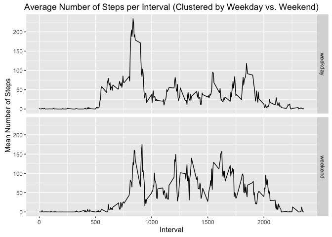

# Reproducible Research: Peer Assessment 1
Please note, that to implement the ploting in this report, the `ggplot` library has been used. For all code snipets below, this library is already available.


## Loading and preprocessing the data
To load the data into the R environment, I am going to take the contents from the Github branch as a starting point, which includes the activity monitoring data inside a zip-compressed file. 

The following steps have to be performed from there:

1.  extract the core data source file, by using the unzip function in R
2.  ingest the data using read.csv to read the file, taking into account the type of each data column, NA values, and format of dates
3.  clean up things not needed anymore. I by purpose remove unneeded objects, and also remove intermittent files 

The respective code looks like this:

```r
AMD.zipname <- "activity.zip"
AMD.filename <- "activity.csv"
# unpack the original source file
if (!file.exists(AMD.filename)) {
    unzip(zipfile = AMD.zipname, files = AMD.filename)
}

# ingest data source into data.table with appropriate column types
AMD.data.raw <- read.csv(AMD.filename, header = TRUE, sep = ",", colClasses = c(steps = "numeric", 
    date = "Date", interval = "numeric"), na.strings = "NA")
```
This will internalize the data into a variable called AMD.data, with the following structure:

```
## 'data.frame':	17568 obs. of  3 variables:
##  $ steps   : num  NA NA NA NA NA NA NA NA NA NA ...
##  $ date    : Date, format: "2012-10-01" "2012-10-01" ...
##  $ interval: num  0 5 10 15 20 25 30 35 40 45 ...
```

## What is mean total number of steps taken per day?
To calculate the mean total number of steps per day, we need to aggregate the steps of all intervals for each individual day. The result shall be shown in histogram.

The code looks like this:

```r
## aggregating the data
AMD.aggregated.raw <- aggregate(steps ~ date, data = AMD.data.raw, sum)

## creating the histogram plot
qplot(AMD.aggregated.raw$steps, geom = "histogram", binwidth = 1000, main = "Overview on the frequency of total steps per day on the raw data (incl. NA)", 
    xlab = "Number of steps", ylab = "Number of days with specific steps")
```

 

The mean and median of the frequency distribution can be easily explored like this:

```r
summary(AMD.aggregated.raw$steps)
```

```
##    Min. 1st Qu.  Median    Mean 3rd Qu.    Max. 
##      41    8841   10760   10770   13290   21190
```

## What is the average daily activity pattern?
By calculating the average number of steps per interval over all days, we could see whether there are specific points during the day, were there are more activities than during other times. This does not take into account, that the day during the week (i.e. weekdays and weekends) most probably might create a difference, too.

Anyway, we average over the intervals, which looks like this:

```r
## aggregated per interval over all days
AMD.msi.raw <- aggregate(steps ~ interval, data = AMD.data.raw, mean)

# creating the line plot
qplot(interval, steps, data = AMD.msi.raw, geom = c("line"), main = "Average Number of Steps per Interval (over all Days)", 
    xlab = "Interval", ylab = "Mean Number of Steps")
```

 

## Imputing missing values

### Identify incomplete observations
The `NA` value could generally be observed in each variable of an observation, in which case it is not complete. Therefore, I can use the `complete.cases` function to select the proper cases.

On the other hand, I looked through the variables separately, and realized, that only the `steps` variable will have `NA` values.


```r
cases.quality <- complete.cases(AMD.data.raw)
cases.nok <- sum(!cases.quality)

nrow(AMD.data.raw[is.na(AMD.data.raw$steps), ])
```

```
## [1] 2304
```

```r
nrow(AMD.data.raw[is.na(AMD.data.raw$date), ])
```

```
## [1] 0
```

```r
nrow(AMD.data.raw[is.na(AMD.data.raw$interval), ])
```

```
## [1] 0
```

We see that we have 2304 of incomplete cases, of a total number of 17568.

My strategy to replace the `NA` values will be to assign the mean for the 5-minute interval to it.
Since I already have identified the incomplete cases (see above), I need to iterate over them and assign the values from `AMD.msi`.


```r
AMD.data.cleaned <- AMD.data.raw
for (row in which(!cases.quality)) {
    i <- AMD.data.cleaned[row, c("interval")]
    AMD.data.cleaned[row, c("steps")] <- AMD.msi.raw[AMD.msi.raw$interval == 
        i, c("steps")]
}
```

### Histogram of the Cleaned Dataset
Creating the new histogram is straight forward and identical to the previous one, only this time using `AMD.data.cleaned`.

```r
## aggregating the data
AMD.aggregated.cleaned <- aggregate(steps ~ date, data = AMD.data.cleaned, sum)

## creating the histogram plot
qplot(AMD.aggregated.cleaned$steps, geom = "histogram", binwidth = 1000, main = "Overview on the frequency of total steps per day on the cleaned data", 
    xlab = "Number of steps", ylab = "Number of days with specific steps")
```

 

### Comparison of the Mean and Median
Comparing the two analysis, is straight forward:

```r
summary(AMD.aggregated.raw$steps)
```

```
##    Min. 1st Qu.  Median    Mean 3rd Qu.    Max. 
##      41    8841   10760   10770   13290   21190
```

```r
summary(AMD.aggregated.cleaned$steps)
```

```
##    Min. 1st Qu.  Median    Mean 3rd Qu.    Max. 
##      41    9819   10770   10770   12810   21190
```
We can see that the impact is the mean staying unchanged, while the median has shifted slightly upward, as for 1st and 3rd quantiles.

## Differences in Activity Patterns Weekdays vs. Weekends?
The patterns where analyzed on the mean number of steps per interval of all days. I will reuse the that data set and separate it into weekdays and weekend sets.

```r
AMD.data.raw <- cbind(AMD.data.raw, weekday = ifelse(weekdays(AMD.data.raw$date, 
    abbreviate = TRUE) %in% c("Sat", "Sun"), "weekday", "weekend"))
AMD.msi.raw <- aggregate(steps ~ interval + weekday, data = AMD.data.raw, mean)
```

### Weekday Pattern Activity
Strangely, the weekdays have less number of steps on an average, while weekend days show more activity.

```r
library(ggplot2)
qplot(interval, steps, data = AMD.msi.raw, geom = c("line"), facets = weekday ~ 
    ., main = "Average Number of Steps per Interval (Clustered by Weekday vs. Weekend)", 
    xlab = "Interval", ylab = "Mean Number of Steps")
```

 

## Conclusion
A conclusion we might take, is that the analyzed person has a office job, or similar, and that it uses it's weekends to get active. This could be the pattern of a office worker or student. It would be interesting to compare more activity measurements from those two groups.

Furthermore, it is interesting to see, that early in the day there is a peak in the data, regardless of whether we are analyzing weekdays or weekends. This might indicate some special activity during that period, e.g. going out for jogging.
